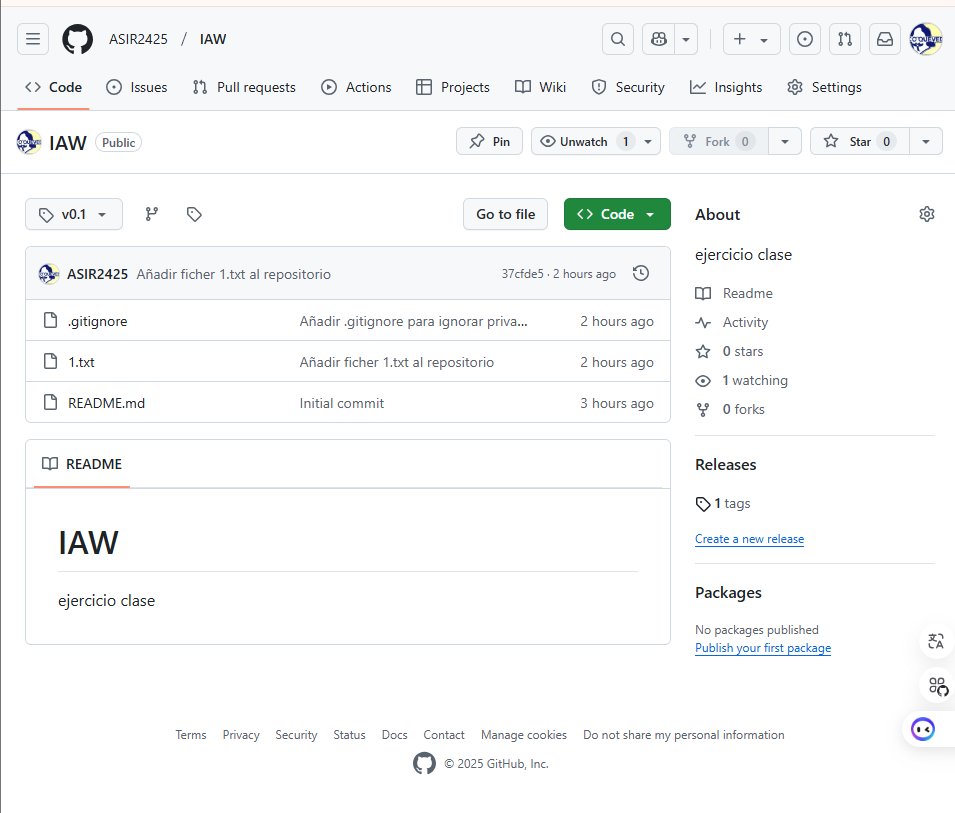

# Informe de ejercicios del repositorio IAW

## Ejercicio 1: Crear repositorio IAW

git init
git remote add origin https://github.com/ASIR2425/IAW.git
git add .
git commit -m "Initial commit"
git push -u origin main


## Ejercicio 2: Ignorar archivos y carpetas

touch privado.txt
mkdir privada
echo "privado.txt" >> .gitignore
echo "privada/" >> .gitignore
git add .gitignore
git commit -m "Añadir .gitignore para ignorar privado.txt y privada/"

## Ejercicio 3: Añadir fichero 1.txt

touch 1.txt
git add 1.txt
git commit -m "Añadir fichero 1.txt"
git push origin main

## Ejercicio 4: Crear y subir un tag v0.1

git tag v0.1
git push origin v0.1

## Ejercicio 5: Crea una tabla 
| Nombre          | Apellidos       | Usuario de GitHub | Repositorio DEAW                           |
|-----------------|-----------------|-------------------|--------------------------------------------|
| Mellisa         | Mellisa         | @melii1206        | [IAW-2](https://github.com/melii1206/IAW-2)|
| Zidane          | Zidane          | @aviuno8          | [IAW](https://github.com/aviuno8/IAW)      |
| Ernesto         | Ernesto Sos     | @ernestosr9       | [IAW](https://github.com/ernestosr9/IAW)   |


## Ejercicio 6: Añadir a un colaborador

 Acceder a Settings > Collaborators importante estar en el repositorio en el que queremos que colabore en nuestro caso IAW.
 Añadir a carlosgs-iesquevedo como colaborador.

## Ejercicio 7: Añadir capturas de pantalla

 Toma capturas de pantalla de los pasos importantes (por ejemplo, la creación del tag, la tabla en el `README.md`, etc.).
 Guarda las capturas en la carpeta `informe/capturas`.
 Añade las imágenes al archivo `informe.md` usando la sintaxis de Markdown:

   ```markdown
   


                                                  [ To suspend, type ^T^Z ]
^G Help        ^O Write Out   ^F Where Is    ^K Cut         ^T Execute     ^C Location    M-U Undo       M-A Set Mark
^X Exit        ^R Read File   ^\ Replace     ^U Paste       ^J Justify     ^/ Go To Line  M-E Redo       M-6 Copy
